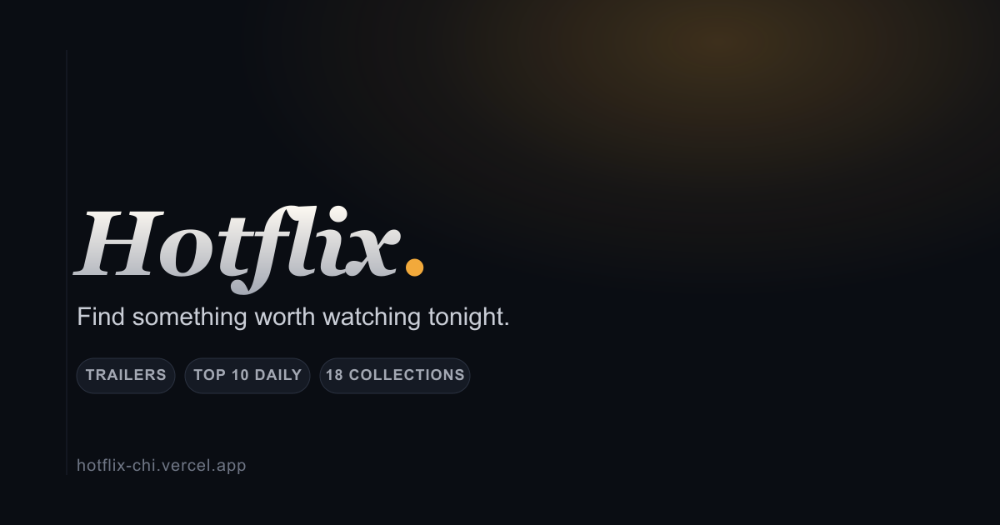

<div align="center">

# Hotflix

A film discovery app: trending picks, a daily Top 10, curated collections, trailers and a personal watchlist.

[](https://nextjs.org)
[](https://react.dev)
[](https://www.typescriptlang.org)
[](https://www.themoviedb.org/documentation/api)

[Live demo](https://hotflix-chi.vercel.app/) · [Report a bug](https://github.com/C-J7/hotflix/issues)



</div>

## Contents

- [Features](#features)
- [Stack](#stack)
- [Architecture](#architecture)
- [Getting started](#getting-started)
- [Scripts](#scripts)
- [Project structure](#project-structure)
- [Credit](#credit)

## Features

- **Tonight's Pick**: an auto-advancing editorial hero drawn from the week's most-watched films.
- **Top 10 today**: a daily ranking with oversized numerals, refreshed hourly.
- **Collections**: 18 genre collections, each with Popular, Top rated and Newest views, plus infinite scroll.
- **Trailers**: official YouTube trailers in a focused player, fetched on demand rather than upfront.
- **My List**: a watchlist stored in `localStorage`. No account required.
- **Search**: instant, debounced search from anywhere on the site (press `/`).

## Stack

Next.js 16 (Pages Router), React 19, TypeScript, CSS Modules, [TMDB API](https://www.themoviedb.org/documentation/api).

No UI framework, no client-side data-fetching library, no CSS framework: plain `fetch`, `getStaticProps`/ISR, and hand-written CSS. The whole app has four runtime dependencies.

## Architecture

**TMDB calls stay server-side.** `lib/tmdb.ts` is imported only by `getStaticProps` and the three `pages/api/*` routes, so the API key never reaches the browser. Client-side data (search, paginated collections, on-demand trailers) goes through those routes, which set `Cache-Control` headers so Vercel's CDN, not TMDB, serves repeat requests.

**Pages are prerendered with ISR.** The homepage, `/browse`, `/collections/*` and individual `/movie/[id]` pages are static HTML regenerated on a schedule (1 hour to 1 day, depending on how often the data actually changes), so first paint is instant and the app stays indexable.

**Motion respects `prefers-reduced-motion`** globally, and the auto-advancing hero and background carousels both check it explicitly before animating.

## Getting started

Requires Node 20.9 or later.

```bash
npm install
cp .env.example .env.local
npm run dev
```

Add your TMDB v3 API key to `.env.local`. Get a free one at [themoviedb.org/settings/api](https://www.themoviedb.org/settings/api).

The app runs at `http://localhost:3000`.

## Scripts

| Command | Description |
| --- | --- |
| `npm run dev` | Start the dev server |
| `npm run build` | Production build |
| `npm run start` | Serve the production build |
| `npm run lint` | Run ESLint |
| `npm run typecheck` | Run `tsc --noEmit` |

## Project structure

```
components/    UI components (cards, rows, hero, dialogs, header, layout)
hooks/         useWatchlist, useHydrated
lib/           TMDB client, formatting helpers, genre list, shared types
pages/         Routes and API endpoints (Pages Router)
pages/api/     Server-side TMDB proxy: search, discover, trailer lookup
styles/        CSS Modules, one file per component/page
```

## Credit

Film data and images from [TMDB](https://www.themoviedb.org). This product uses the TMDB API but is not endorsed or certified by TMDB.

Built by [Bamgbose Christian](https://bamgbosechristian.me).
